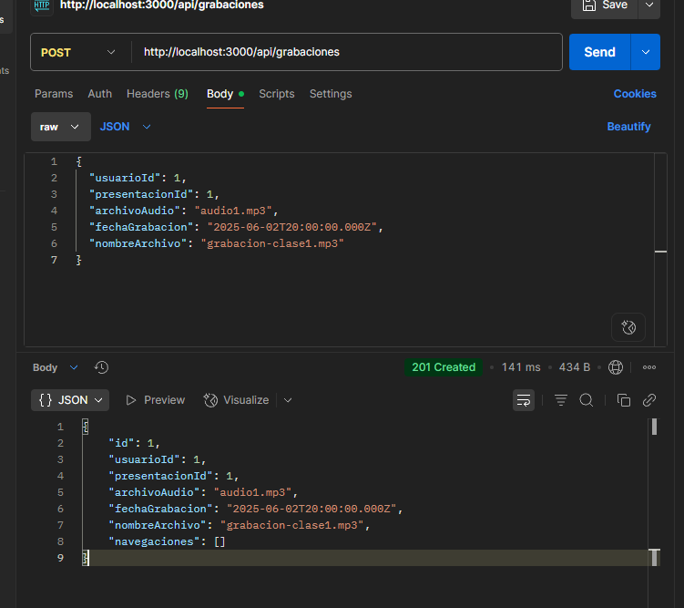
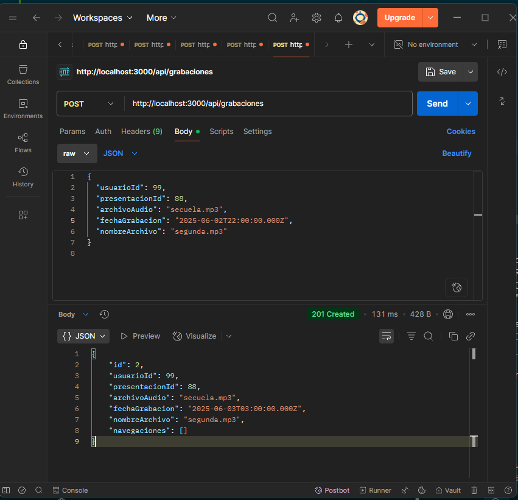
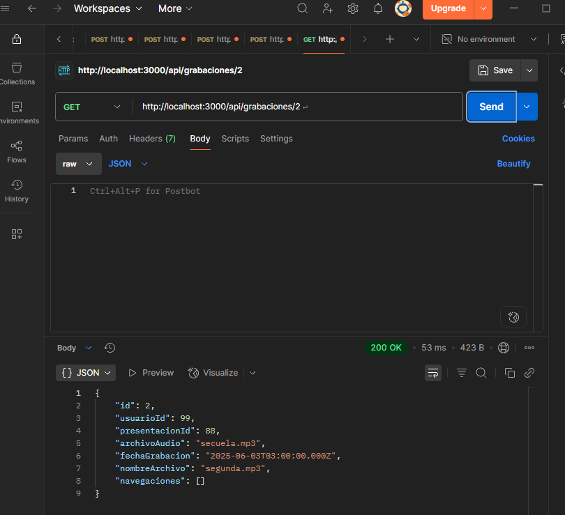

# Práctica 3 - Aplicaciones para el Servidor Web

## 🧠 Entidad trabajada

Se trabajó con la entidad `GrabacionEntity`, aplicando una arquitectura limpia en N-Capas.  
Se implementaron los casos de uso, repositorio, datasource y rutas HTTP para los métodos `POST` y `GET`.

---

## ⚙️ Configuración inicial

1. Se levantó un contenedor con PostgreSQL usando `docker compose up`.
2. Se modificó `synchronize: true` en el archivo `typeorm.config.ts` para autogenerar las tablas.
3. Se instalaron dependencias y se ejecutó el servidor:

```bash
npm install
npm run dev
```

---

## 📬 Pruebas con Postman (TypeORM)

### 📤 POST `http://localhost:3000/api/grabaciones`

- **Headers**:
  - `Content-Type: application/json`
- **Body (raw JSON)**:

```json
{
  "usuarioId": 1,
  "presentacionId": 1,
  "archivoAudio": "audio1.mp3",
  "fechaGrabacion": "2025-06-02T20:00:00.000Z",
  "nombreArchivo": "grabacion-clase1.mp3"
}
```

### ✅ Respuesta esperada:

```json
{
  "id": 1,
  "usuarioId": 1,
  "presentacionId": 1,
  "archivoAudio": "audio1.mp3",
  "fechaGrabacion": "2025-06-02T20:00:00.000Z",
  "nombreArchivo": "grabacion-clase1.mp3",
  "navegaciones": []
}
```



---

## 🔁 Cambio a Sequelize

### 📦 Instalación:

```bash
npm install sequelize pg pg-hstore
npm install --save-dev @types/sequelize
```

### 📁 Estructura:

- Se creó un nuevo archivo `grabacion.sequelize.datasource.ts` en `infrastructure/datasource/`.
- Se creó el modelo Sequelize en `data/sequelize/models/grabacion.model.ts`.
- Se configuró la conexión en `data/sequelize/sequelize.config.ts`.

### 🔁 Para alternar entre TypeORM y Sequelize:

En el archivo `presentation/grabacion/routes.ts`, comentar o descomentar la línea del repositorio:

```ts
// TypeORM
// const repo = new GrabacionTypeOrmDatasourceImpl();

// Sequelize
const repo = new GrabacionSequelizeDatasource();
```

---

## 🧪 Pruebas con Sequelize

### 📤 POST `http://localhost:3000/api/grabaciones`

```json
{
  "usuarioId": 99,
  "presentacionId": 88,
  "archivoAudio": "secuela.mp3",
  "fechaGrabacion": "2025-06-02T22:00:00.000Z",
  "nombreArchivo": "segunda.mp3"
}
```

### ✅ Respuesta esperada:

```json
{
  "id": 2,
  "usuarioId": 99,
  "presentacionId": 88,
  "archivoAudio": "secuela.mp3",
  "fechaGrabacion": "2025-06-03T03:00:00.000Z",
  "nombreArchivo": "segunda.mp3",
  "navegaciones": []
}
```



### 🔍 GET por ID

```http
GET http://localhost:3000/api/grabaciones/2
```



---

## 📌 Conclusión

El proyecto cumple con:
- Separación de capas (dominio, infraestructura, presentación).
- Uso de dos ORMs (TypeORM y Sequelize) de forma intercambiable.
- Pruebas realizadas con Postman para verificar el funcionamiento completo de la arquitectura REST.

---

## 🧭 Instrucciones para ejecutar el proyecto

```bash
# Inicializar base de datos
docker-compose up -d

# Instalar dependencias
npm install

# Ejecutar servidor
npm run dev
```
